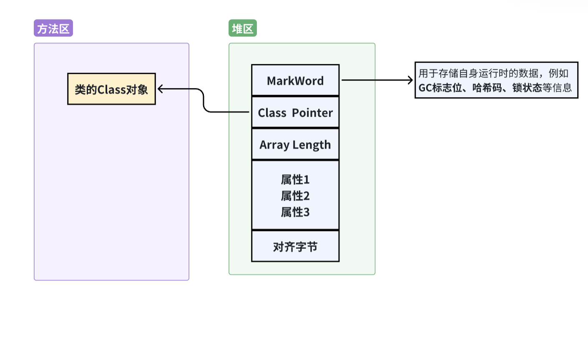

# 二、线程安全的解决方案--锁

## 1.自增运算不是线程安全的
实验：10个线程并行运行，对一个共享数据进行自增运算，每个线程自增运算3000次
具体写法看：[ P1_BaseThread.java](src/main/java/P2/P2_1_UnsafeTest.java)

预期结果应该是30000，但实际结果小于这个数字

## 2.线程安全的解决方案--synchronized关键字
synchronized关键字是Java的保留字，当使用synchronized关键字修饰一个方法的时候，
该方法被声明为同步方法
改造代码: increment()方法加上了关键字synchronized
```java
class Counter1 {
    public int value = 0;
    public synchronized void increment() {
        value++;
    }
}
```
实验看：[ P2_2_SafeTest](src/main/java/P2/P2_2_SafeTest.java)


## 3. Java对象详解与三种锁
### a.一个具体的Java对象（Object实例）包含三个部分，
Java内置锁涉及很多重要信息，这些都存放在对象结构中，并且存放于对象头的Mark Word字段中
看图：


### b.三位二进制组成的内置锁状态
Java内置锁的状态总共有4种，级别由低到高依次为：无锁、偏向锁、轻量级锁和重量级锁
由于目前主流的JVM都是64位，因此我们使用64位的Mark Word。
64位的Mark Word中，有三个值需要注意：

（1）lock：锁状态标记位，占两个二进制位，由于希望用尽可能少的二进制位表示尽可能多的信息，
因此设置了lock标记。该标记的值不同，整个Mark Word表示的含义就不同。

（2）biased_lock：对象是否启用偏向锁标记，只占1个二进制位。
为1时表示对象启用偏向锁，为0时表示对象没有偏向锁

| biased_lock | lock            | 状态    | 说明                                     |
| ----------- | --------------- | ----- | -------------------------------------- |
| 0           | 01              | 无锁    | 普通对象，未加锁，可存哈希值                         |
| 1           | 01              | 偏向锁   | 偏向某个线程，Mark Word 里会记录线程 ID             |
| 0           | 00              | 轻量级锁  | 进入同步块时，JVM 会用 CAS 把对象头替换为指向锁记录的指针      |
| 0           | 10              | 重量级锁  | 线程竞争激烈，锁升级为重量级，Mark Word 指向 Monitor 对象 |
| -           | 11              | GC 标记 | 用于垃圾回收，表示该对象已被标记                       |

### c.四种锁的使用情况

**（注意锁的切换还会使除了 biased_lock | lock的标志位以外的word发生重大变化，这里先不细讲）**

(1)无锁 : Java对象刚创建时还没有任何线程来竞争，说明该对象处于无锁状态

(2)偏向锁: 是指一段同步代码一直被同一个线程所访问，那么该线程会**自动获取锁**，
降低获取锁的代价。如果内置锁处于偏向状态，
当有一个线程来竞争锁时，先用偏向锁，表示内置锁偏爱这个线程，这个线程要执行该锁关联的同步代码时，
不需要再做任何检查和切换。偏向锁在竞争不激烈的情况下效率非常高。

(3)轻量级锁: 当锁处于偏向锁，又被另一个线程企图抢占时，偏向锁就会升级为轻量级锁。
企图抢占的线程会通过**自旋**的形式尝试获取锁，不会阻塞抢锁线程，以便提高性能。

**解释**：
**自旋原理**非常简单，如果持有锁的线程能在很短时间内释放锁资源，
那么那些等待竞争锁的线程就不需要进行内核态和用户态之间的切换来进入阻塞挂起状态，
它们只需要等一等（自旋），
等持有锁的线程释放锁后即可立即获取锁，这样就**避免了用户线程和内核切换的消耗**

但是，线程自旋是需要消耗CPU的，如果一直获取不到锁，
那么线程也不能一直占用CPU自旋做无用功，所以需要设定一个自旋等待的最大时间。
JVM对于自旋周期的选择，JDK 1.6之后引入了适应性自旋锁，
适应性自旋锁意味着**自旋的时间不是固定的**，而是由前一次在同一个锁上的自旋时间以及锁的拥
有者的状态来决定的。线程**如果自旋成功了，下次自旋的次数就会更多**，
如果自旋失败了，自旋的次数就会减少。

(4)重量级锁重量级锁会让其他申请的线程之间进入阻塞，性能降低。重量级锁也叫同步锁


## 4.四种锁的原理和实战详解